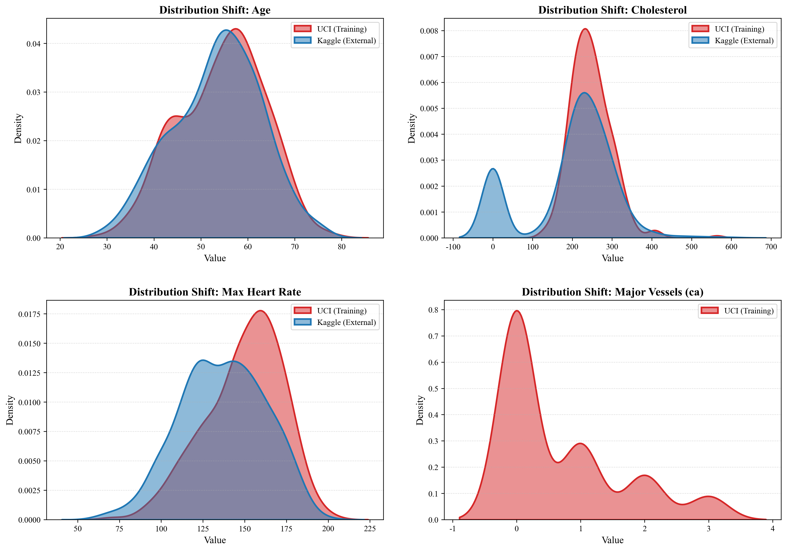

# Generalizability Boundaries of Tabular-to-Text Transformers in Clinical Prediction

> ⚠️ **Manuscript Status**: This repository contains the official code and experimental logs for the paper "Generalizability Boundaries of Tabular-to-Text Transformers in Clinical Prediction: A Mechanistic Analysis of Specificity Collapse under Distribution Shift". The manuscript is currently under review.

This project enables autonomous AI-driven experimentation for cardiovascular disease diagnosis using transformer architectures. The system automatically explores optimal model configurations through iterative experimentation, guided by clinical metrics (AUC, Sensitivity, Specificity).

## 🎯 Key Features

- **Autonomous Architecture Search**: AI agents automatically modify model architecture and hyperparameters
- **Clinical-Focused Evaluation**: Optimized for real-world medical metrics (AUC, Sensitivity, Specificity) rather than just accuracy
- **K-Fold Cross Validation**: Reduces evaluation variance from ~0.10 to ~0.02, providing publication-ready statistics (mean ± std)
- **Structured-to-Text Pipeline**: Novel approach converting structured patient data into natural language for transformer processing
- **Rapid Prototyping**: 5-minute training cycles enable 100+ experiments overnight
- **Cross-Platform**: Supports Apple Silicon (MPS), NVIDIA GPUs, and CPU environments

## 🚀 Quick Start

### Prerequisites
- Python 3.10+
- Apple Silicon Mac or NVIDIA GPU
- [uv](https://docs.astral.sh/uv/) package manager

### Installation

```bash
# Clone the repository
git clone https://github.com/Zhanbingli/medical-automl.git
cd medical-automl

# Install dependencies
uv sync

# Prepare data and train tokenizer (~2 min)
uv run prepare.py

# Run a single training experiment (~5 min)
uv run train.py
```

## 📊 Project Structure

```
medical-automl/
├── figures/                        # Paper figures (public)
│   ├── fig1_architecture.pdf/png   # Model architecture
│   ├── roc_curve_paper.pdf/png      # ROC curves
│   ├── confusion_matrix.pdf/png     # Confusion matrix
│   ├── rf_feature_importance.pdf/png # Feature importance
│   ├── generalizability.pdf/png     # External validation
│   └── dataset_distribution_shift.pdf/png
├── figures/supplementary/           # Supplementary figures (non-public)
├── results/                        # Experimental results (JSON/TSV)
├── scripts/                        # Experiment scripts
│   ├── plot_*.py                    # Visualization scripts
│   ├── figure*.py                  # Figure generation
│   └── experiment_*.py             # Ablation studies
├── docs/                           # Documentation
│   ├── KFOLD_GUIDE.md              # K-fold cross validation guide
│   ├── BASELINE_GUIDE.md           # Baseline comparison guide
│   └── STATISTICAL_TESTS_GUIDE.md  # Statistical tests guide
├── data/                           # Preprocessed data
├── saved_models/                   # Trained model checkpoints
├── prepare.py                      # Data preprocessing
├── train.py                        # Single-fold training
├── train_kfold.py                  # K-fold cross validation
├── run_baseline_sota.py            # SOTA baseline comparison
└── statistical_tests.py            # Statistical significance testing
```

## 🔄 K-Fold Cross Validation (Recommended for Papers)

For **stable, publication-ready results**, use K-fold cross validation instead of single validation split:

```bash
# 1. Prepare K-fold data (one-time, ~1 min)
uv run python prepare_kfold.py --k_folds 5

# 2. Run K-fold training (~25 min total = 5 folds × 5 min)
uv run python train_kfold.py --k_folds 5

# 3. View stable results with mean ± std
# Example output:
# AUC: 0.910000 ± 0.020976  (much more stable than single split!)
```

**Why K-fold?**
- Reduces variance from ~0.10 to ~0.02
- Tests model on all data points
- Provides confidence intervals for papers
- See [KFOLD_GUIDE.md](KFOLD_GUIDE.md) for detailed documentation

## 🔬 How It Works

### 1. Data Textualization
Structured patient records are converted into a standardized natural language narrative:
`Patient Features: Age 63, Sex 1, Chest Pain Type 1, Resting Blood Pressure 145, Cholesterol 233, ... Final Diagnosis: 0`

### 2. Tokenization
Custom BPE tokenizer trained on the clinical narrative corpus with an 8,192 vocabulary size, ensuring efficient subword segmentation of clinical numeric values.

### 3. Autonomous Experimentation
AI agents iterate on `train.py` to optimize:
- Model architecture (depth, width, attention patterns)
- Hyperparameters (learning rates, dropout, batch size)
- Optimization strategies (Muon + AdamW)

### 4. Clinical Evaluation
Reports comprehensive clinical metrics:
- **AUC**: Area Under ROC Curve (primary metric)
- **Sensitivity**: True Positive Rate (minimize false negatives)
- **Specificity**: True Negative Rate (minimize false positives)

## 📈 Key Findings (As reported in manuscript)

This repository emphasizes mechanistic interpretability and robustness testing rather than pure performance chasing on small cohorts.

| Model / Paradigm            | Internal CV (AUC) | External Validation (AUC) | Specificity Drop      |
| --------------------------- | ----------------- | ------------------------- | --------------------- |
| Random Forest (Baseline)    | 0.952 ± 0.021     | 0.891 ± 0.042             | Maintained (95.2%)    |
| Tabular-to-Text Transformer | 0.762 ± 0.070     | 0.624 ± 0.033             | **Collapsed (65.6%)** |

**Conclusion**: While the agent-optimized Transformer successfully learns predictive representations, it exhibits a critical structural vulnerability (Specificity Collapse) when encountering out-of-distribution imputation artifacts (e.g., zero-padded missing features) in multi-center external validation, a failure mode avoided by traditional tree-based routing.

## 📊 Results Visualization

### Specificity Collapse & Decision Boundary Oscillation


**Description**: The codebase includes scripts to reproduce the core mechanistic finding of the paper. When the Transformer encoder encounters uniform zero-padding for missing features in the external Kaggle cohort (acting as severe out-of-distribution tokens), its global attention mechanism is catastrophically disrupted. This repository provides the tools to visualize this phenomenon through KDE distribution plots, attention weight mapping, and confusion matrix reconstruction.
## 🏆 SOTA Baseline Comparison (5-Fold CV)

Compare your Transformer model against 8+ SOTA baselines using **identical 5-fold cross validation** for fair comparison:

```bash
# Run 5-fold CV baseline comparison (~25-30 minutes)
uv run python run_baseline_sota.py

# Generate publication-ready visualizations
uv run python visualize_baselines_5fold.py
```

**Models Compared** (all use same 5-fold splits with seed=42):
- **Deep Learning**: TabNet (Google Research), ResNet for Tabular Data, Deep MLP
- **Traditional ML**: XGBoost, Random Forest, Gradient Boosting, SVM (RBF), Logistic Regression

**Fair Comparison Features**:
- ✅ Same 5-fold splits as your Transformer (StratifiedKFold, seed=42)
- ✅ Separate StandardScaler per fold (fit on train, transform val)
- ✅ Same evaluation metrics: AUC, Sensitivity, Specificity, Accuracy
- ✅ Statistical reporting: mean ± std across 5 folds
- ✅ Direct comparison with your Transformer results

**Output**:
- Clinical metrics (mean ± std) for all models
- AUC comparison with error bars
- Fold-by-fold consistency visualization
- Statistical ranking and significance
- JSON results for reproducibility

### Statistical Significance Testing

After running baseline comparison, perform statistical tests to validate significance:

```bash
# Run Wilcoxon signed-rank tests (paired 5-fold results)
uv run python statistical_tests.py
```

**Features**:
- Wilcoxon signed-rank test for paired 5-fold AUC results
- Effect size calculation (rank-biserial correlation *r*)
- Bootstrap 95% confidence intervals (10,000 samples)
- Automatic comparison with all baselines
- LaTeX table generation for papers

**Output**:
- Console table with p-values and effect sizes
- `statistical_tests_results.json` - detailed results
- `statistical_tests_table.tex` - LaTeX table for papers

**Interpretation**:
- p < 0.05: Statistically significant difference
- Effect size |r|: <0.1 negligible, <0.3 small, <0.5 medium, ≥0.5 large
- 95% CI: Bootstrap confidence interval for mean AUC difference

## 🧪 Running Autonomous Experiments

1. **Read agent instructions**:
   ```bash
   cat program.md
   ```

2. **Start AI agent** (Claude/Codex/etc.):
   ```
   "Please read program.md and help me optimize the cardiovascular diagnosis model."
   ```

3. **Monitor progress**:
   ```bash
   tail -f run.log
   ```

4. **Track results**:
   ```bash
   cat results_clinical.tsv
   ```

## 🏗️ Architecture Highlights

- **GPT-style Transformer**: Decoder-only architecture with rotary positional embeddings
- **Muon Optimizer**: Advanced second-order optimization for 2D parameters
- **Value Embeddings**: Alternating layer enhancement mechanism
- **Sliding Window Attention**: Efficient attention patterns (SSSL configuration)

## 📚 Dataset

Based on the UCI Heart Disease dataset:
- 303 patient records
- 13 clinical features (age, sex, chest pain type, blood pressure, cholesterol, etc.)
- Binary classification task (presence/absence of heart disease)

## 🤝 Contributing

This project welcomes contributions! Areas for improvement:
- Multi-dataset validation
- Cross-validation implementation
- Additional medical domains
- Interpretability tools (SHAP, attention visualization)

## 📝 Citation

If you use this project in your research, please cite:

```bibtex
@software{medical_automl,
  author = {Zhanbingli},
  title = {Generalizability Boundaries of Tabular-to-Text Transformers in Clinical Prediction: A Mechanistic Analysis of Specificity Collapse under Distribution Shift
},
  url = {https://github.com/Zhanbingli/medical-automl},
  year = {2026}
}
```

## 📄 License

MIT License - see [LICENSE](LICENSE) file for details.

This project is inspired by autoresearch concepts but represents independent development focused on medical applications.

## 🙏 Acknowledgments

- UCI Machine Learning Repository for the Heart Disease dataset
- PyTorch team for the deep learning framework
- rustbpe for high-performance tokenization

## 📧 Contact

For questions or collaboration:
- GitHub Issues: https://github.com/Zhanbingli/medical-automl/issues
- Author: Zhanbingli

---

**Disclaimer**: This project is for research and educational purposes only. Not intended for clinical use without proper validation and regulatory approval.
