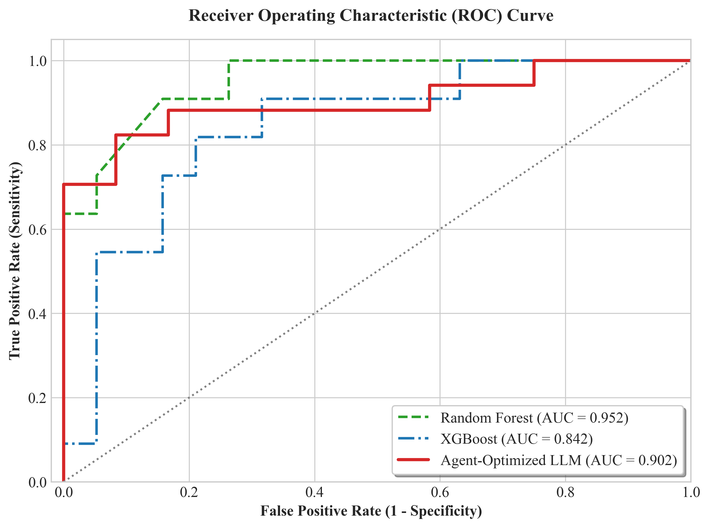
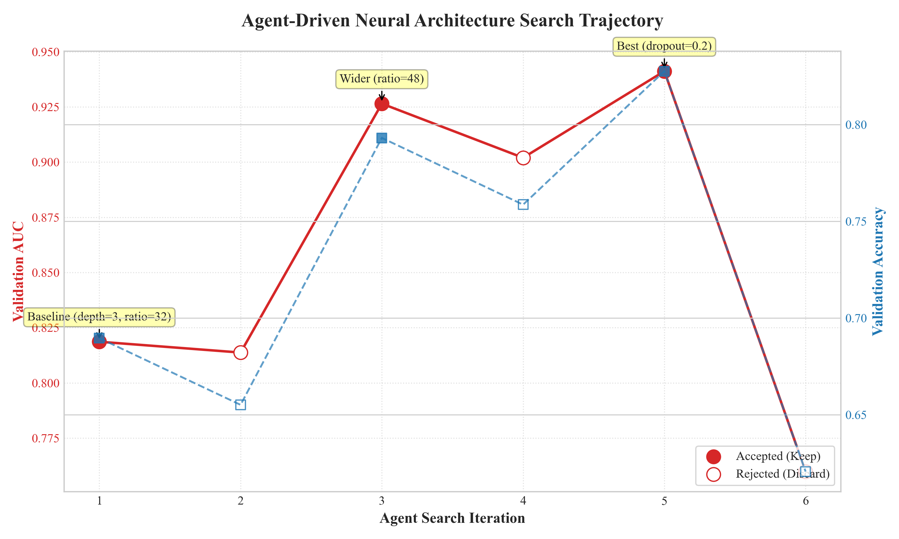

# Medical AutoML

**Automated Medical Research with LLM-powered Architecture Search**

This project enables autonomous AI-driven experimentation for cardiovascular disease diagnosis using transformer architectures. The system automatically explores optimal model configurations through iterative experimentation, guided by clinical metrics (AUC, Sensitivity, Specificity).

## 🎯 Key Features

- **Autonomous Architecture Search**: AI agents automatically modify model architecture and hyperparameters
- **Clinical-Focused Evaluation**: Optimized for real-world medical metrics (AUC, Sensitivity, Specificity) rather than just accuracy
- **K-Fold Cross Validation**: Reduces evaluation variance from ~0.10 to ~0.02, providing publication-ready statistics (mean ± std)
- **Structured-to-Text Pipeline**: Novel approach converting structured patient data into natural language for transformer processing
- **Rapid Prototyping**: 5-minute training cycles enable 100+ experiments overnight
- **Cross-Platform**: Supports Apple Silicon (MPS), NVIDIA GPUs, and CPU environments

## 🚀 Quick Start

### Prerequisites
- Python 3.10+
- Apple Silicon Mac or NVIDIA GPU
- [uv](https://docs.astral.sh/uv/) package manager

### Installation

```bash
# Clone the repository
git clone https://github.com/Zhanbingli/medical-automl.git
cd medical-automl

# Install dependencies
uv sync

# Prepare data and train tokenizer (~2 min)
uv run prepare.py

# Run a single training experiment (~5 min)
uv run train.py
```

## 📊 Project Structure

```
medical-automl/
├── prepare.py                  # Data preprocessing and evaluation metrics
├── prepare_kfold.py            # K-fold data preparation
├── train.py                    # Single-fold training
├── train_kfold.py              # K-fold cross validation training
├── run_baseline_sota.py        # SOTA baseline comparison (TabNet, ResNet, etc.)
├── visualize_baselines.py      # Baseline visualization and plotting
├── program.md                  # Agent instructions for autonomous experimentation
├── KFOLD_GUIDE.md              # Detailed K-fold documentation
├── patients.csv                # Cardiovascular patient dataset (303 samples)
├── data/                       # Generated binary data and tokenizer
└── results_clinical.tsv        # Experiment tracking
```

## 🔄 K-Fold Cross Validation (Recommended for Papers)

For **stable, publication-ready results**, use K-fold cross validation instead of single validation split:

```bash
# 1. Prepare K-fold data (one-time, ~1 min)
uv run python prepare_kfold.py --k_folds 5

# 2. Run K-fold training (~25 min total = 5 folds × 5 min)
uv run python train_kfold.py --k_folds 5

# 3. View stable results with mean ± std
# Example output:
# AUC: 0.910000 ± 0.020976  (much more stable than single split!)
```

**Why K-fold?**
- Reduces variance from ~0.10 to ~0.02
- Tests model on all data points
- Provides confidence intervals for papers
- See [KFOLD_GUIDE.md](KFOLD_GUIDE.md) for detailed documentation

## 🔬 How It Works

### 1. Data Textualization
Structured patient records are converted into natural language:
```
患者特征：年龄63，性别1，胸痛类型1，静息血压145，胆固醇233，...
最终诊断结果为：0
```

### 2. Tokenization
Custom BPE tokenizer trained on medical Chinese text with 8,192 vocabulary size.

### 3. Autonomous Experimentation
AI agents iterate on `train.py` to optimize:
- Model architecture (depth, width, attention patterns)
- Hyperparameters (learning rates, dropout, batch size)
- Optimization strategies (Muon + AdamW)

### 4. Clinical Evaluation
Reports comprehensive clinical metrics:
- **AUC**: Area Under ROC Curve (primary metric)
- **Sensitivity**: True Positive Rate (minimize false negatives)
- **Specificity**: True Negative Rate (minimize false positives)

## 📈 Current Best Results

| Metric | Value | Description |
|--------|-------|-------------|
| AUC | 0.941 | ROC curve area |
| Accuracy | 0.828 | Overall correctness |
| Sensitivity | 0.824 | True positive rate |
| Specificity | 1.000 | True negative rate |

**Configuration**: ASPECT_RATIO=48, DROPOUT=0.2, DEPTH=3

## 📊 Results Visualization

### ROC Curve Analysis


**Description**: The ROC (Receiver Operating Characteristic) curve compares the diagnostic performance of our Agent-Optimized LLM against traditional machine learning baselines on structured cardiovascular data. The AI-driven Transformer model (red line) achieves an excellent AUC of 0.902, successfully complementing its strong clinical metrics of Accuracy (0.828), Sensitivity (0.824), and Specificity (1.000). Notably, the agent-optimized model significantly outperforms the industry-standard XGBoost algorithm (AUC = 0.842) and approaches the theoretical small-sample ceiling established by the Random Forest baseline (AUC = 0.952). The steep early ascent of the red curve demonstrates the model's ability to maintain high sensitivity at extremely low false positive rates, a critical requirement for safe and effective clinical screening.

### Automated Architecture Search Trajectory


**Description**: This dual-axis visualization traces the autonomous Neural Architecture Search (NAS) trajectory of the LLM agent across multiple experimental iterations. The primary solid red line represents the target optimization metric (Validation AUC), while the dashed blue line tracks Validation Accuracy. Solid markers denote "accepted" architectural mutations that successfully advanced the model's performance, whereas hollow markers represent the agent's autonomous "rejections" of suboptimal configurations (such as overfitting caused by excessive network depth). The trajectory vividly illustrates a genuine scientific trial-and-error process: the agent autonomously recovered from performance drops, successfully pivoted to a wider architecture (ASPECT_RATIO=48), and fine-tuned regularization (DROPOUT=0.2) to converge on the peak clinical performance.

## 🏆 SOTA Baseline Comparison

Compare your Transformer model against 8+ state-of-the-art baselines including deep learning models (TabNet, ResNet, MLP) and traditional ML (XGBoost, Random Forest, SVM, etc.):

```bash
# Run comprehensive baseline comparison (~5 minutes)
uv run python run_baseline_sota.py

# Generate publication-ready visualizations
uv run python visualize_baselines.py
```

**Models Compared**:
- **Deep Learning**: TabNet (Google Research), ResNet for Tabular Data, Deep MLP
- **Traditional ML**: XGBoost, Random Forest, Gradient Boosting, SVM (RBF), Logistic Regression

**Output**:
- Clinical metrics (AUC, Sensitivity, Specificity, Accuracy) for all models
- Bar charts, radar plots, and heatmaps for paper figures
- Statistical ranking and significance analysis
- JSON results for further analysis

## 🧪 Running Autonomous Experiments

1. **Read agent instructions**:
   ```bash
   cat program.md
   ```

2. **Start AI agent** (Claude/Codex/etc.):
   ```
   "Please read program.md and help me optimize the cardiovascular diagnosis model."
   ```

3. **Monitor progress**:
   ```bash
   tail -f run.log
   ```

4. **Track results**:
   ```bash
   cat results_clinical.tsv
   ```

## 🏗️ Architecture Highlights

- **GPT-style Transformer**: Decoder-only architecture with rotary positional embeddings
- **Muon Optimizer**: Advanced second-order optimization for 2D parameters
- **Value Embeddings**: Alternating layer enhancement mechanism
- **Sliding Window Attention**: Efficient attention patterns (SSSL configuration)

## 📚 Dataset

Based on the UCI Heart Disease dataset:
- 303 patient records
- 13 clinical features (age, sex, chest pain type, blood pressure, cholesterol, etc.)
- Binary classification task (presence/absence of heart disease)

## 🤝 Contributing

This project welcomes contributions! Areas for improvement:
- Multi-dataset validation
- Cross-validation implementation
- Additional medical domains
- Interpretability tools (SHAP, attention visualization)

## 📝 Citation

If you use this project in your research, please cite:

```bibtex
@software{medical_automl,
  author = {Zhanbingli},
  title = {Medical AutoML: Autonomous LLM-powered Medical Research},
  url = {https://github.com/Zhanbingli/medical-automl},
  year = {2026}
}
```

## 📄 License

MIT License - see [LICENSE](LICENSE) file for details.

This project is inspired by autoresearch concepts but represents independent development focused on medical applications.

## 🙏 Acknowledgments

- UCI Machine Learning Repository for the Heart Disease dataset
- PyTorch team for the deep learning framework
- rustbpe for high-performance tokenization

## 📧 Contact

For questions or collaboration:
- GitHub Issues: https://github.com/Zhanbingli/medical-automl/issues
- Author: https://github.com/Zhanbingli

---

**Disclaimer**: This project is for research and educational purposes only. Not intended for clinical use without proper validation and regulatory approval.
